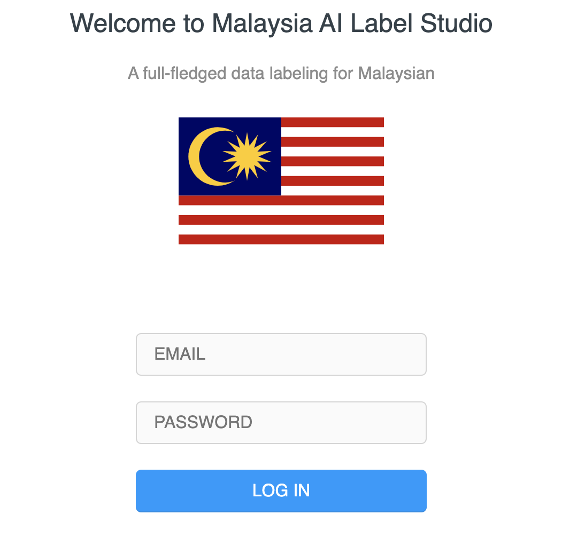

# Label Studio for Malaysia AI

This repo is for Malaysia AI use to collect annotation, https://label.malaysiaai.ml

## how-to get access

1. Contact husein.zol05@gmail.com or khursani8@gmail.com to get register link.



## how-to deploy

1. Install local development,

```bash
# install miniconda
pip3 install -e .
python3 label_studio/manage.py migrate
python3 label_studio/manage.py runserver
```

2. Run as a service,

```bash
sudo cp label-studio.service /etc/systemd/system/
sudo systemctl daemon-reload
sudo systemctl enable label-studio.service 
sudo systemctl start label-studio.service
```

## Citation

```tex
@misc{Label Studio,
  title={{Label Studio}: Data labeling software},
  url={https://github.com/heartexlabs/label-studio},
  note={Open source software available from https://github.com/heartexlabs/label-studio},
  author={
    Maxim Tkachenko and
    Mikhail Malyuk and
    Nikita Shevchenko and
    Andrey Holmanyuk and
    Nikolai Liubimov},
  year={2020-2021},
}
```

## License

This software is licensed under the [Apache 2.0 LICENSE](/LICENSE) © [Heartex](https://www.heartex.ai/). 2020-2021


